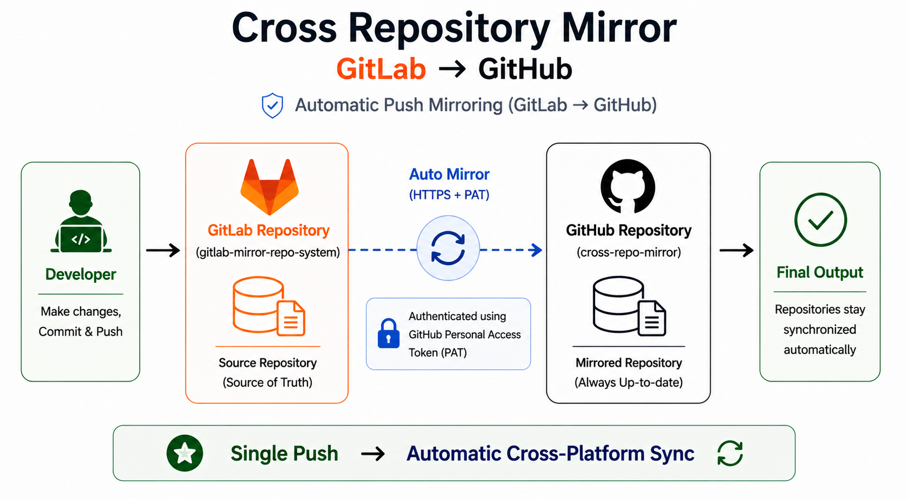
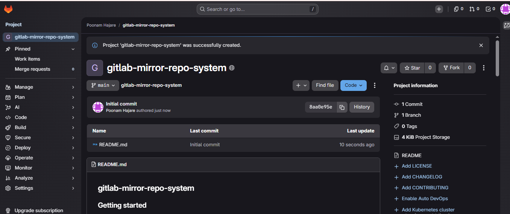
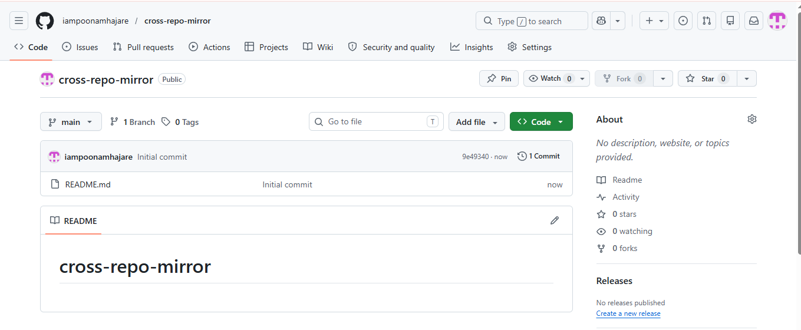
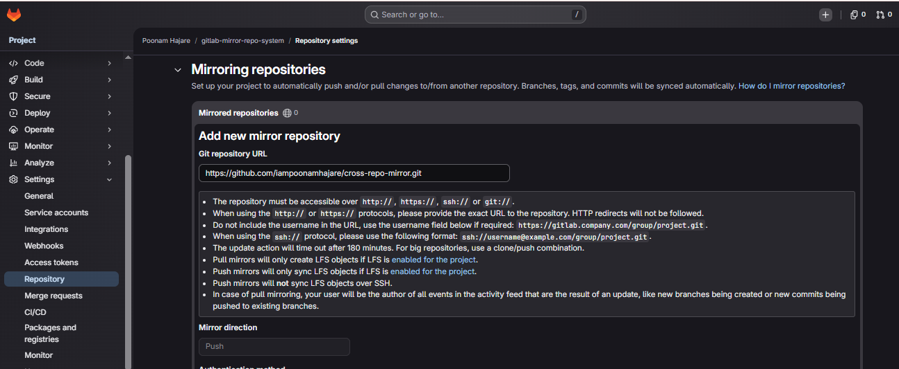
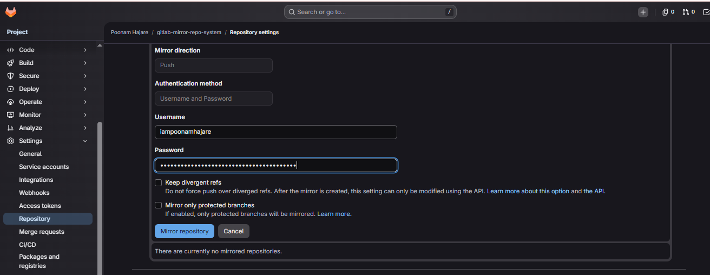
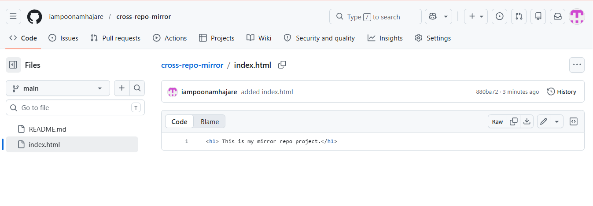
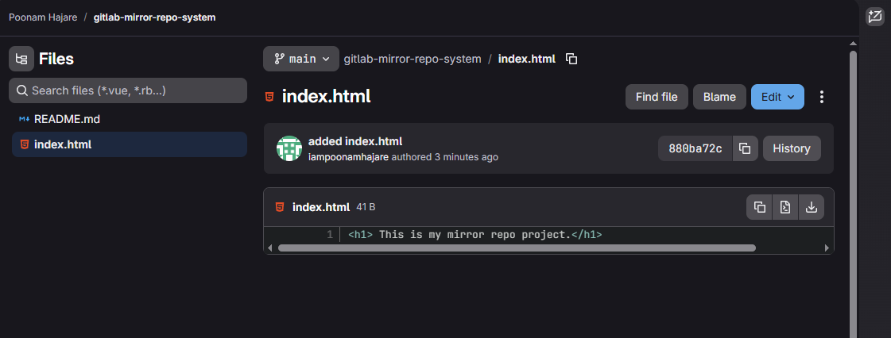

#  Cross Repo Mirror (GitLab → GitHub)

## Project Overview
- This project demonstrates repository mirroring between GitLab and GitHub using built-in mirroring features.

- The GitLab repository **gitlab-mirror-repo-system** is configured to automatically push changes to the GitHub repository **cross-repo-mirror**, ensuring both repositories stay in sync.

---
## Key Features

* Automatic push-based repository mirroring
* Secure authentication using GitHub Personal Access Token
* Cross-platform synchronization (GitLab → GitHub)
* Real-time updates across repositories

---
## Architecture
```
Developer → gitlab-mirror-repo-system (GitLab)
             ↓
     Push Mirroring Enabled
             ↓
   cross-repo-mirror (GitHub)
```

  

### Flow Explanation
- Developer pushes code to GitLab (repo-mirror-system)
- GitLab triggers Push Mirroring Configuration
- Authenticated using GitHub Personal Access Token
- Code is automatically synced to GitHub (cross-repo-mirror)
---

### Source Repository (GitLab)
   - Primary development happens here
   - All commits originate from this repository
### Destination Repository (GitHub)
   - Automatically updated via mirroring
   - Reflects latest changes from GitLab
---

## Setup Steps

### 1. Create GitLab Repository

* Name: `gitlab-mirror-repo-system`
* Visibility: Public
* Initialize with README
  
---

### 2. Create GitHub Repository

* Name: `cross-repo-mirror`
* Add README
  
---

### 3. Generate GitHub Personal Access Token

* Go to GitHub Settings → Developer Settings
* Personal Access Tokens → Tokens (Classic)
* Generate new token
* Select required permissions
* Copy the token

---

### 4. Configure Mirroring in GitLab

* Go to: **Settings → Repository → Mirroring Repositories**
* Add new mirror:

  * Git Repository URL → GitHub repo HTTPS URL
  * Mirror Direction → Push
  * Username → GitHub username
  * Password → Paste token

  
  
---

### 5. Clone Repository

```bash
git clone <gitlab-repo-url>
cd repo-mirror-system
```

---

### 6. Add Sample File

```html
<h1>Repository Mirroring Project</h1>
```

---

### 7. Push Changes

```bash
git add .
git commit -m "added index.html"
git push
```
  
  
---

## Final Output

* Changes pushed to GitLab are automatically mirrored to GitHub
* Both repositories remain synchronized

---

## Use Cases

* Backup repositories across platforms
* Collaboration across GitHub and GitLab users
* Migration between version control systems
* Disaster recovery setup

---

